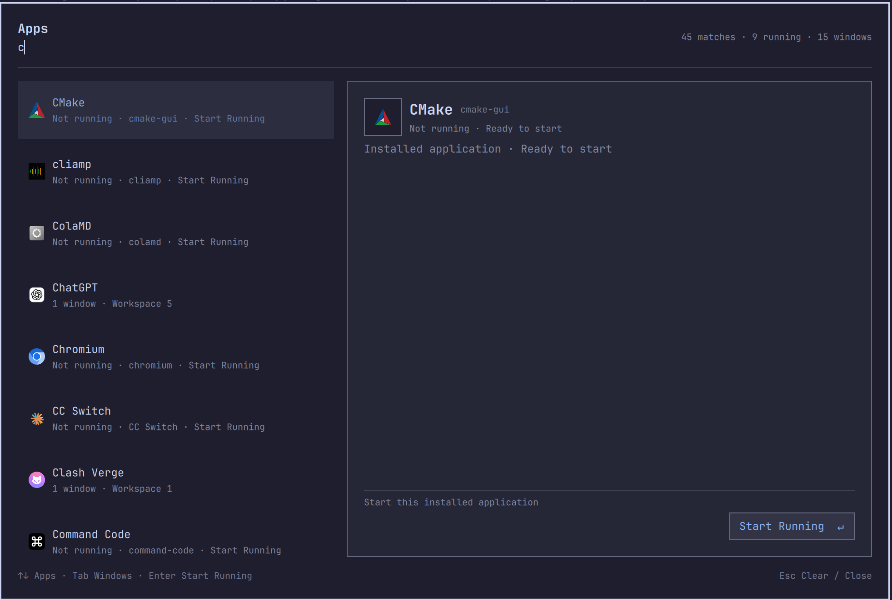

# AppDeck

[中文](README.zh-CN.md) | **English**

AppDeck is an application launcher and window switcher for the Omarchy desktop. Search and start applications, switch between running apps, or focus a specific window—even on another workspace.

- Applications on the left; window titles and workspaces on the right.
- Fuzzy search, keyboard navigation, and mouse support.
- Chinese input and Fcitx5 support through your desktop input method.
- Request all windows of an app to close, or force-kill the app after confirmation.



## Installation

### Requirements

- Omarchy 4 with Hyprland / Wayland, Omarchy Shell, and Quickshell.
- An Omarchy installation that provides the `omarchy plugin` commands.
- Git to download the plugin.

No additional build step or background service is required.

### Install and enable

Run this in a terminal and confirm the installation when prompted:

```bash
omarchy plugin add https://github.com/Turing-Cat/AppDeck.git --enable
```

If the plugin is already installed but disabled, run:

```bash
omarchy plugin enable appdeck.app
```

### Set an opening shortcut

Installing the plugin does not add a keybinding. Add the following to `~/.config/hypr/bindings.lua` to bind `Alt + Space` to AppDeck. `hl.unbind` replaces any existing binding for that combination; you can choose another combination instead.

```lua
hl.unbind("ALT + SPACE")
o.bind("ALT + SPACE", "AppDeck", "omarchy-shell shell toggle appdeck.app")
```

Reload and check the configuration:

```bash
hyprctl reload
hyprctl configerrors
```

You can also toggle the panel from a terminal:

```bash
omarchy-shell shell toggle appdeck.app
```

### Disable or remove

To disable AppDeck without removing its files:

```bash
omarchy plugin disable appdeck.app
```

To uninstall it, run and confirm when prompted:

```bash
omarchy plugin remove appdeck.app
```

If you added the shortcut above, remove those two lines from `~/.config/hypr/bindings.lua` and run `hyprctl reload`. Restore your previous binding there if needed. The plugin does not edit your keybindings automatically.

## Usage

1. Press `Alt + Space` to open the panel.
2. Type an application name and use `↑` / `↓` to select an app.
3. Press `Enter` to request an installed app to start, or focus a running app's most recently used window.
4. To choose a specific window, press `Tab` to enter the window list. Cycle with `Tab` / `Shift + Tab`, then press `Enter` to switch. You can also click a window directly.

Up and Down always select applications. The first Tab selects the most recently used window; subsequent presses move through the other windows. Editing the search or selecting another app exits window selection. Focusing a window on another workspace switches to that workspace and focuses the window.

The list updates as windows open, close, or move. Your window selection stays on the same window; if that window disappears, the panel asks you to select again.

Chinese input requires a configured desktop input method. While composing text, candidate keys are handled by the input method without launching an app or switching windows.

## Shortcuts

| Shortcut or action | Behavior |
| --- | --- |
| `Alt + Space` | Toggle the panel, after configuring the binding above |
| Type text | Fuzzy-search application names |
| `↑` / `↓` | Select the previous / next application |
| `Page Up` / `Page Down` | Select applications by page |
| `Home` / `End` | Select the first / last application |
| `Tab` | Enter window selection; then select the next window, wrapping to the first |
| `Shift + Tab` | Enter window selection; then select the previous window, wrapping to the last |
| `Enter` / Focus button | Focus the selected window, or the most recent window without an explicit selection; start an app that is not running |
| Click an application row | Focus its most recent window, or start the app |
| Click a window row | Focus that window |
| `Ctrl + U` | Clear the search |
| `Delete` | Request all windows of the selected app to close |
| `Shift + Delete` | Open the selected app's Kill confirmation |
| `Escape` | Clear a non-empty search; close the panel when the search is empty |

During window selection, `Delete` and `Shift + Delete` do not close anything. The Close and Kill buttons always apply to all windows of the selected app.

Close requests a normal shutdown, so an app may still show a save prompt. Kill requires confirmation and may lose unsaved work. The confirmation dialog selects Kill by default. Use `←` / `→` or Tab to change the selection, `Enter` to activate it, or `Escape` to cancel.

## License

[MIT](LICENSE)
